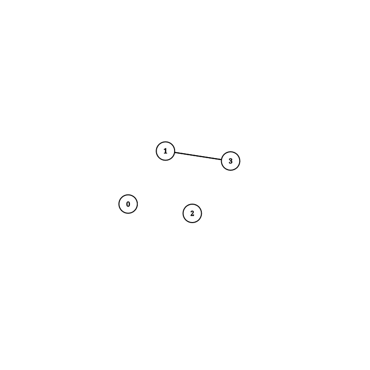

## How to build
To build the project, you need cmake (>=3.10) and a C++17 compiler. Clone the repository and run the following commands in the project's root directory:
```bash
cd build
cmake .. -DPARLAY_OPENMP=On
```
The `-DPARLAY_OPENMP=On` flag enables OpenMP support in the Parlay library.

## How to run
To run the project, run the following commands in the project's root directory:
```bash
cd build
make <target> SOURCE=<source node>
```

The make target selects the dataset to use. The available targets are listed in the Datasets section. The `ID` of the source node is passed to the program using the `SOURCE` environment variable.

Each time the code is compiled, a vectorization report is written to a file named `optinfo.txt` in the build directory.

The program will output the computed distances to a file named `*_distances.out` in the directory where the `make` command is executed from.

## Datasets
The datasets are automatically downloaded in the `datasets` directory when the project is built. Note that the pokec dataset is 600MB in size and may take a while to download.
| Make target | Filename          | `\|V\|` | `\|E\|`  | Notes            | Source    |
|-------------|-------------------|---------|----------|------------------|-----------|
| test        | test.txt          | 16      | 32       |                  | Handcrafted |
| 0degree     | 0degree.txt       | 4       | 2        | Contains unconnected vertices and 0-degree vertices | Handcrafted |
| random      | random_1k_5k.txt  | 1000    | 9940     |                  | Speedcode |
| powergrid   | powergrid.txt     | 4942    | 13190    | Power grid       | [^1]      |
| epinions    | epinions.txt      | 75879   | 508837   | Social network   | [^2]      |
| twitch      | twitch.txt        | 168113  | 13595114 | Social network   | [^3]      |
| pokec       | pokec.txt         | 1632804 | 44603928 | Social network   | [^4]      |
| roadnet-ca  | roadnet-ca.txt    | 1971281 | 5533214  | Road network (California) | [^5] |

The datasets taken from the SNAP dataset collection were converted to undirected graphs by adding the reverse of each edge and the edges were sorted by source vertex and destination vertex. The Python script used to convert the datasets is available in the `utils` directory.

[^1]: https://toreopsahl.com/datasets/#uspowergrid
[^2]: http://snap.stanford.edu/data/soc-Epinions1.html
[^3]: https://snap.stanford.edu/data/twitch_gamers.html
[^4]: http://snap.stanford.edu/data/soc-Pokec.html
[^5]: http://snap.stanford.edu/data/roadNet-CA.html

## Graphs
|  | 
|:--:| :--:|
| *Test graph* | *0-degree graph* |